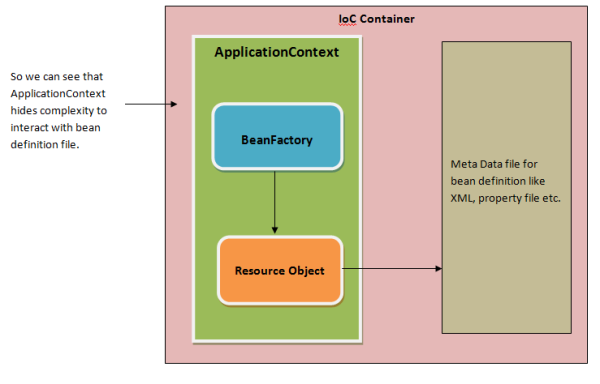

# di-practice

## Dependency Injection (DI)

- 의존성 주입
  - 한 객체가 다른 객체를 사용할 때 의존성이 있다고 한다
- 런타임 시 의존 관계를 맺는 대상을 외부에서 결정하고 주입해 주는 것
- 스프링 프레임워크는 DI 기능을 지원해주는 프레임워크

### 장점

- 의존성 주입을 인터페이스 기반으로 설계하면, 코드가 유연해짐
  - 느슨한 결합도(loose coupling)
- 변경에 유연해짐
  - 결합도가 낮은 객체끼리는 부품을 쉽게 갈아끼울 수 있음

## 실습

- DI 프레임 워크 만들기 (빈 팩토리)

https://techythought.wordpress.com/2013/01/12/92/